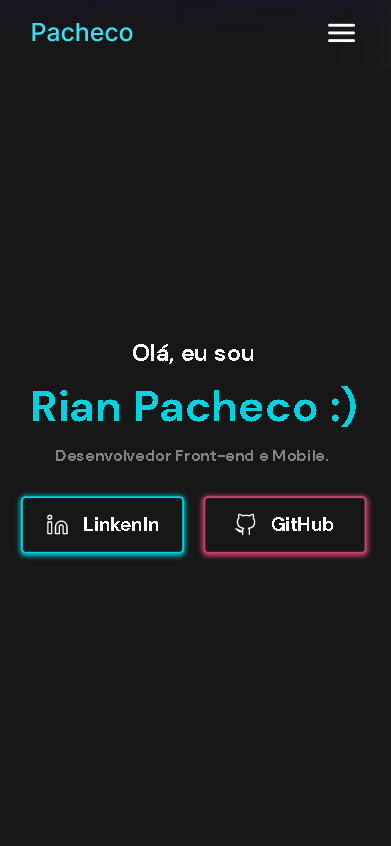
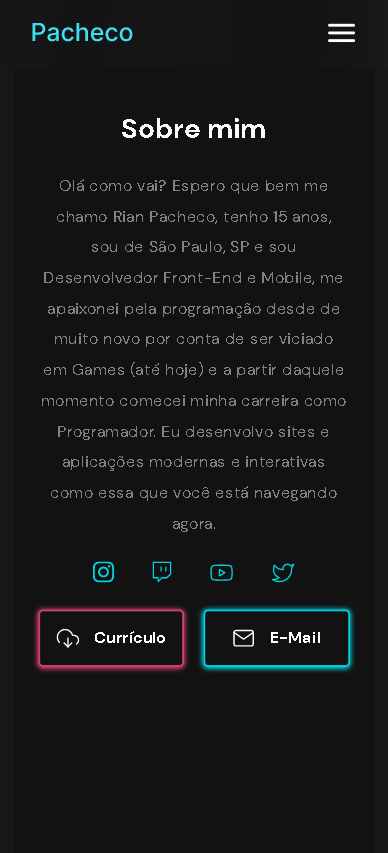
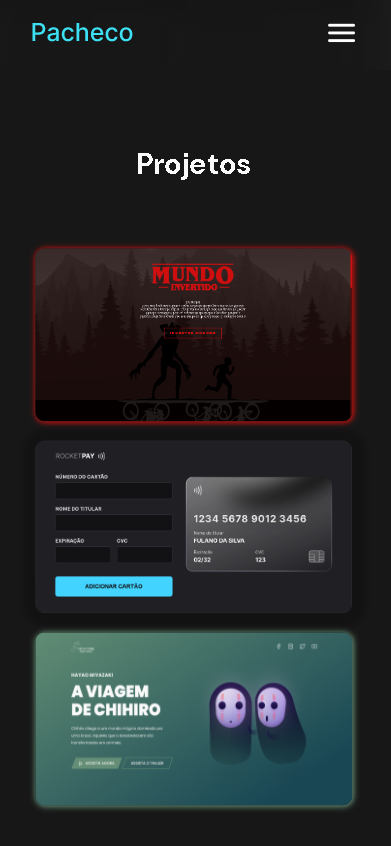
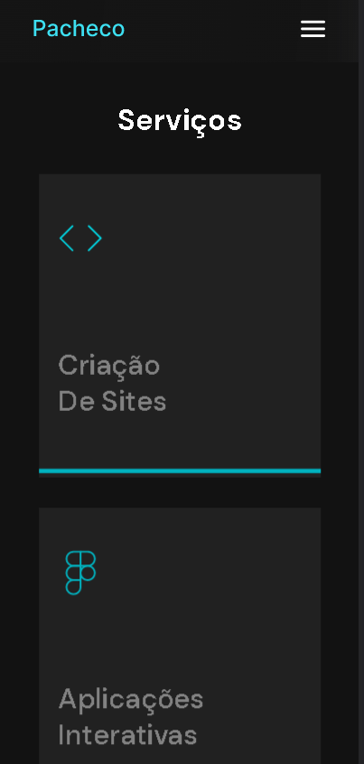
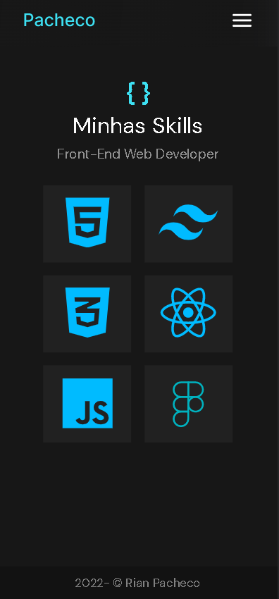
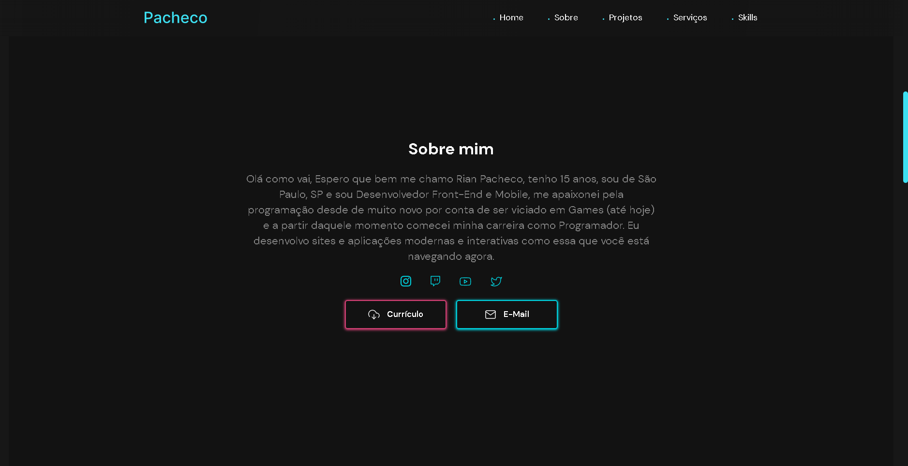
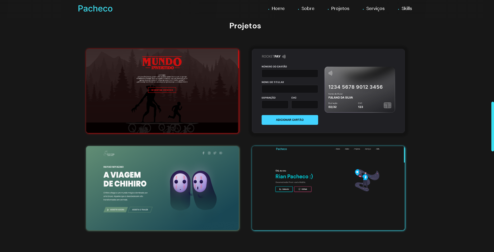
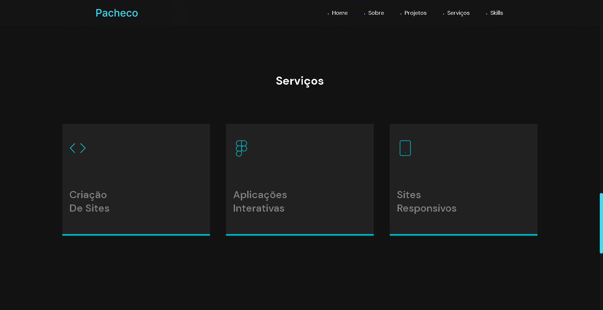
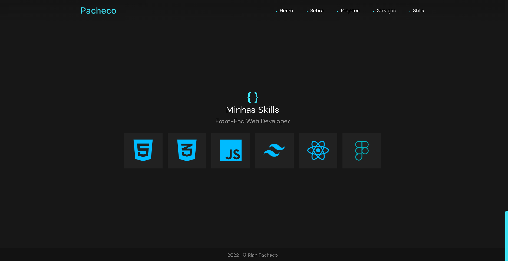

# Portfolio &copy; Rian Pacheco 🚀💯

 

# Sobre o projeto 💎

https://portfolio-rianpacheco.vercel.app

Portfolio é um projeto web construído para contar mais sobre minha trajetoria como dev e um pouco sobre oque eu faço, um resumo...

A aplicação consiste em uma pagina para as pessoas ter acesso mais sobre mim e ter acesso a alguns projetos desenvolvidos por mim..

## Layout mobile 📱
 

## Layout web 💻

# Tecnologias utilizadas 💻 :

## 🔅 Front end
- HTML
- CSS
- JS

## ✔ Implantação em produção 
- Front end web: Vercel

# © Autor

&copy; <a href="https://www.linkedin.com/in/rian-pacheco/"> Rian Pacheco</a>
